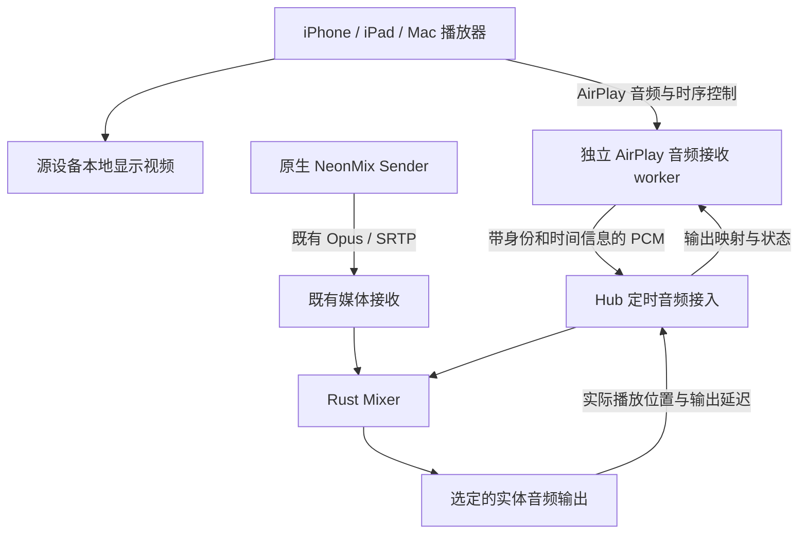

# NeonMix AirPlay Speaker 接入设计方案与技术选型

修订日期：2026-10-01。状态：专项研究与设计，尚未实现或进行 Apple 设备实机验收。

2026-10-02 范围补充：本文初版不支持多个 AirPlay 来源同时混音；新增需求的设计见 [多 AirPlay 设备混音设计](07_NeonMix_多AirPlay设备混音_设计方案.md)，执行安排见 [新开发计划](08_NeonMix_多AirPlay设备混音_开发计划.md)。新文档尚待实施；当前已有单路原型及验证边界以 [STATUS](docs/STATUS.md) 为准，以上状态保留原编写时点。

配套文档：[AirPlay 专项开发计划](04_NeonMix_AirPlay接入_开发计划.md)。依据：[总体设计](01_NeonMix_设计方案与技术选型.md)、[完整开发计划](02_NeonMix_完整开发计划.md)、[当前状态](docs/STATUS.md)及现有 ADR。

## 1 产品目标与范围

**NeonMix 作为 AirPlay Speaker，只接收并播放音频。iPhone、iPad 或未安装 NeonMix 的 Mac 在本机播放视频，画面留在源设备，声音通过 AirPlay 进入 NeonMix Mixer，再从 Hub 选定的扬声器输出。** 音乐、播客等纯音频使用同一接入方式。

Apple 提供从 iPhone/iPad 控制中心、应用内音频选择器，以及 Mac 控制中心的声音输出选择 AirPlay 扬声器的入口。这是本项目的用户入口；用户无需在发送设备安装 NeonMix。[Apple 音频投送说明](https://support.apple.com/en-us/105068)

本专项不接收、解码、呈现或转发视频，不建设屏幕镜像、视频窗口、HLS 视频拉取或 GPU 视频管线，也不将这些能力作为后续必做阶段。应用里的“投到电视”入口不作为操作指引；需要选择的是音频播放目标。

完整交付覆盖 Windows、Linux、macOS 三类 Hub。初版一次接受一个 AirPlay 发送端，并支持一路 AirPlay 与一路原生 Sender 混音。多音箱同步、多个 AirPlay 发送端同时混音、公网、无路由器点对点连接不在初版范围。该功能细化总体设计 §9.2，不替代 E06 虚拟声卡，也不自动成为原生 NeonMix v1 的发布依赖。

## 2 可行性与同步边界

**源设备显示视频、远端扬声器播放声音是可行的 AirPlay 音频使用方向；不能把“能传声音”直接当成“任意视频 App 都同步”。** UxPlay 的 Audio-Only `-async` 文档明确描述了接收端音频与客户端视频的时间戳同步，可作为原型依据。[UxPlay 命令说明](https://github.com/FDH2/UxPlay/blob/v1.73.7/uxplay.1)

| 场景 | 专项目标 | 验收重点 |
|---|---|---|
| iPhone / iPad 音乐、播客 | 必选 | 原生音频选择器可发现、连接、播放、调音及停止 |
| Mac 系统声音输出 | 必选 | 未安装 NeonMix 的 Mac 选择远端 Speaker；普通应用声音进入 Hub |
| Mac 应用内 AirPlay 音频 | 必选并独立验证 | Music 等应用入口可能与系统输出走不同路径 |
| 源设备播放视频，NeonMix 播放声音 | 核心目标 | 视频仍在源设备；指定 App 的音频路由、音画差、暂停/seek/恢复通过 |
| 游戏、乐器监听、通话 | 不作低延迟或兼容承诺 | 没有可提前缓冲的视频，且应用音频会话/路由不同 |
| 受保护内容 | 按源 App 实测 | 是否允许音频路由由源系统和 App 决定；不需要也不建设视频 DRM 解码 |
| 屏幕镜像或视频接收请求 | 不支持 | 不接受视频媒体，不通过隐藏画面伪装支持 |

观看点播视频时，源播放器可能延后本地画面，接收端按协议目标时刻播放声音；NeonMix 的职责是准确兑现声音的呈现时刻。若源 App 不使用相应补偿，NeonMix 无法远程让其视频延后，必须如实列为该 App/入口下不同步。

上游说明 UxPlay 的同步音频模式可能带来约秒级播放延迟，且 `-al` 所报告的延迟可能被客户端忽略。因此不能承诺修改一个延迟字段就能让所有客户端补偿，也不能用原生 Sender 的 P95 120/180 ms 指标验收 AirPlay。[UxPlay 同步与延迟说明](https://github.com/FDH2/UxPlay/blob/v1.73.7/README.md)

兼容报告分别记录“可发现”“可播放音频”“源端视频与远端声音同步”。有音乐播放证据而没有视频伴音证据时，不能宣布本次目标全部完成。

## 3 技术选型

### 3.1 接收引擎比较

| 候选 | 与纯音频目标的关系 | 本项目选择 |
|---|---|---|
| Shairport Sync 5.5.2 | 专注 AirPlay 音频及定时输出，方向最贴近 Speaker；主要面向 Linux/BSD | Linux 音频与时间正确性的优先对照；三端适用性不足，暂不作为统一默认引擎 |
| UxPlay 1.73.7 音频路径 | 有音频接收及客户端视频同步选项，上游覆盖 macOS/Linux/Windows | 三端原型首选候选；必须验证真正的 Speaker 能力声明、拒绝视频及许可边界 |
| Shairplay 等经典 RAOP 实现 | 可作为经典音频协议参考 | 未证明当前系统、配对及三端发布完整性，不直接替换为生产默认 |
| 商业音频接收 SDK | 可能满足专有分发与三端接入 | 条件替代；必须核实接口、授权、架构和同步支持，当前无已选供应商 |
| 自研完整 AirPlay 栈 | 全部协议兼容和维护变成自有工作 | 不推荐作为初版路径 |

来源：[Shairport Sync](https://github.com/mikebrady/shairport-sync/blob/5.5.2/README.md)、[UxPlay](https://github.com/FDH2/UxPlay)、[Shairplay](https://github.com/juhovh/shairplay)。推荐结论是结合现有三端项目的工程判断；Shairport Sync 不支持视频不再是排除理由，因为本系统本来就只处理音频。

Shairport Sync 的 AirPlay 2 路径依赖 NQPTP 独占 UDP 319/320，上游说明这与 macOS 已使用的端口冲突；Windows 也没有与 Linux 等价的现成 AirPlay 2 产品路线。经典模式需另行评估，不能将此限制扩大成“所有 Shairport 模式都不能移植”。其 pipe/stdout 输出只能控制交接前的时序，后续 Mixer 和声卡仍需反馈。[AirPlay 2 限制](https://github.com/mikebrady/shairport-sync/blob/5.5.2/AIRPLAY2.md)、[输出同步说明](https://github.com/mikebrady/shairport-sync/blob/5.5.2/README.md)

### 3.2 推荐决策及进入条件

建议 AP00 先在三端方向上验证 UxPlay 的音频路径，并在 Linux 用 Shairport Sync 作同步对照。默认产品只保留一个选定引擎；不因为有两个候选就同时维护两套生产栈。

UxPlay 成为正式技术基线前，必须通过以下条件：原生声音列表可选；关闭视频能力后纯音频握手仍正常；可以保留时间戳并输出到 Mixer；认证与撤销有效；三端可打包；许可与项目分发方式相容。任一关键条件失败，调整薄桥接或改选接收 SDK，不把支持镜像当作补救。

**`-vs 0` 不是纯 Speaker 产品开关。** 上游说明该选项只是抑制显示，镜像模式仍可能以降低的帧率收到视频。产品需要同时收敛发现能力、会话协商和媒体准入，且不加载视频解码器；这些是待实现的改造，不能说原版 UxPlay 已经满足。[UxPlay 参数说明](https://github.com/FDH2/UxPlay/blob/v1.73.7/README.md)

### 3.3 固定版本与依赖

| 组件 | 本次核实基线 | 用法 |
|---|---|---|
| UxPlay | `v1.73.7`，2026-09-04；commit `df67c212a433cf6dda3676dd40c097900d24e645` | 音频原型候选；不追随标为 1.74 Experimental 的主分支 |
| Shairport Sync | `5.5.2`，2026-09-14；commit `7bad231c18368dbd26f298577f6210e36e4b0797` | Linux 对照；AP00 后决定是否继续保留实验工具 |
| Rust / Mixer / DSP | 沿用 workspace 工具链、自有 Mixer、rubato | 不另建声音输出和长期漂移控制器 |
| GStreamer | 现有 1.24 API 基线；macOS 1.28.7、Ubuntu ARM64 1.24.2 为已记录运行时 | 复用音频基础，新增实际协商所需的 ALAC/AAC 解码插件；不增加视频插件 |
| 发现 / 控制 / 文件凭证 | 现有 mdns-sd、权威控制与 .credentials 文件设施 | 新增 AirPlay profile，保持外部来源与原生成员分离 |

UxPlay 1.73.7 修复了认证前缓冲区溢出/空指针问题，原型不固定在更旧教程版本。[发行记录](https://github.com/FDH2/UxPlay/releases/tag/v1.73.7)、[安全公告](https://github.com/FDH2/UxPlay/security/advisories/GHSA-479c-ww7g-wgp8)。Shairport Sync 5.5.2 包含 Apple OS 27 兼容修正，但发行说明不代替 NeonMix 实测。[版本说明](https://github.com/mikebrady/shairport-sync/releases/tag/5.5.2)

## 4 纯音频接入架构



视频路径完全在源设备内部。图中的输出反馈是接收器内部用于调度/校验的接口，不表示存在能强制控制任意远端播放器画面的通用 AirPlay API。

`neonmix-background` 继续管理 Hub；Hub 是 worker 的唯一生命周期 owner。worker 处理 AirPlay 握手、收包、协议时间映射与音频解码，Hub 持有 Mixer 和声卡。UI 关闭或崩溃不停止播放；worker 崩溃只结束 AirPlay 输入，原生 Sender 继续。

| 拟新增或修改模块 | 职责 |
|---|---|
| `crates/airplay-adapter` | worker 管理、音频接入、协议时间到输出时间映射 |
| `crates/airplay-ipc` | 有界控制/媒体消息、版本、身份、时钟域和拒绝规则 |
| `apps/airplay-worker` | 固定接收引擎与最小桥接的构建入口，独立可执行文件 |
| `apps/hub` / `crates/control` | 外部来源准入、配额、权限及权威状态 |
| `crates/audio-core` | 源位置到实际播放位置的非阻塞遥测；保留现有实时约束 |
| `crates/identity` | AirPlay Speaker 服务发布、稳定接收身份 |
| `crates/desktop-service` / `apps/desktop` | 音频接收开关、配对提示、当前来源、占用/断开、同步诊断 |

这些是实施落点建议，本次没有新增代码。Rust 继续实现业务、Mixer 和控制；若采用 UxPlay，只为必要的音频/授权/发现桥接保留少量 C/C++ 补丁，并按 ADR-008 记录边界。

## 5 发现与用户操作

1. 管理员开启“AirPlay 扬声器”，选择接收网卡、房间名和实体音频输出；不要求显示器或虚拟声卡。
2. Hub 启动 worker，验证音频解码、实际监听端口、授权和 Speaker profile 就绪后再广播。
3. iPhone/iPad 在控制中心媒体卡片的音频输出选择器选择 `NeonMix — 客厅`；Mac 从控制中心声音输出或支持的应用音频选择器选择它。
4. 完成源系统支持的原生 PIN/配对；播放视频时确认画面继续留在源设备，声音进入 NeonMix。
5. 用户可在源设备切回本机声音，或由 Hub 管理员断开、禁用接收。关闭接收时撤销广播并关闭监听。

mDNS/DNS-SD 继续使用现有基础设施。经典 RAOP 音频与较新 AirPlay 音频需要的 `_raop._tcp` / `_airplay._tcp` 服务及 TXT 组合由选定协议 profile 确定；AP00 对照原版接收器，AP02 冻结通过实测的组合。`_airplay` 服务名本身不意味着必须支持视频，不能靠删掉某个服务来猜测纯音频行为。原 `_neonmix._tcp` 继续供原生客户端使用。[Apple 发现说明](https://support.apple.com/guide/deployment/use-airplay-dep9151c4ace/web)、[UxPlay 发现实现](https://github.com/FDH2/UxPlay/blob/v1.73.7/lib/dnssd.c)

拟由 Hub 的 mdns-sd 单一 owner 发布 worker 提供的能力和端口；禁用 worker 自身的重复注册。音频格式、配对、公钥、时间模式必须与真实握手相符；关闭视频、照片、镜像和未实现的多房间声明，不能复制 Apple TV 的完整 TXT。兼容性以 Apple 音频选择器可用为准，不把系统缓存中偶尔残留的旧目标当成新能力。

异常视频请求在协议层明确拒绝，不创建解码/显示管线、不转为下载视频。原版隐藏画面的实验不能作为“未接收视频”的验收证据。记录协议事件或受控抓包，证明正常 Speaker 会话没有视频媒体通道。

稳定 receiver ID 和配对材料不随 IP、网卡 MAC、改名或重启改变。UDP 5353 用于发现，其他监听端口按实际引擎配置锁定；NQPTP 的 319/320 仅在对应实验引擎确实使用时出现，不能套给所有候选。多网卡、IPv6 scope、VPN、系统内置接收服务和访客隔离网络单独验证。

## 6 音频管线与时间模型

### 6.1 音频数据与 IPC

接收器解密、重排及解码后，交付带源采样位置和目标播放时刻的 PCM。直接进入 Mixer，不重新编码为 Opus、不走 localhost SRTP，也不通过虚拟声卡回录。

UxPlay `audio_process` 的回调数据仍需按协商格式解码，不能直接视为 float32 PCM。其结构中的 RTP 时间、序号、本地/远端时间可作为接缝，但转换、断点和误差仍需验证。[回调定义](https://github.com/FDH2/UxPlay/blob/v1.73.7/lib/raop.h)、[媒体字段](https://github.com/FDH2/UxPlay/blob/v1.73.7/lib/stream.h)

拟用两个有界本地 IPC 通道分离控制与音频，避免慢 PCM 消费阻塞停止/撤销。macOS/Linux 使用当前用户受限 Unix socket，Windows 使用当前 SID 的 NamedPipe；先使用带长度帧的流式 IPC，测量证明必要后再引入共享内存。

| 字段组 | 用途 |
|---|---|
| `ipc_version / type / payload_bytes / sequence` | 版本、长度检查和消息缺口 |
| `session_id / stream_id / stream_epoch / format_epoch` | Hub 授予的上下文，拒绝旧会话和格式 |
| `source_sample_position / source_rate / frame_count / channel_layout / pcm_format` | 保留真实采样时间线并校验负载 |
| `presentation_time_ns / clock_domain / mapping_id / uncertainty_ns` | 协议要求的声音呈现时刻、时钟域和映射误差 |
| `flags / protocol_gain / gain_applied` | flush/断点、音量来源及是否已应用 |

固定字节序、字段位宽、最大负载和超时，不跨进程传原生结构体布局/指针。音频转换为内部 48 kHz stereo float32；输入采样率、帧长从协议/decoder 取得，不强套 Opus 的 480 帧压缩包。GStreamer 承担解码/标称格式转换，NeonMix 控制器负责相对声卡的长期动态速率补偿，避免双控制器相互修正。

### 6.2 长提前量与现有短队列

当前 Mixer 的交接队列为 8 个 480 帧块，接受年龄约 80 ms，目标水位 70 ms。[媒体合约](docs/MEDIA-CONTROL-CONTRACT.md)、[Mixer](crates/audio-core/src/mixer.rs)。这些值不能直接容纳 AirPlay 可能具有的秒级提前量，也不能通过扩大全部 Mixer 队列拖慢原生输入。

新增有界的定时待播队列放在非实时接入层，保留协议呈现时间，在临近所需时刻将 PCM 交给现有短队列。解码器、重采样群延迟、短队列、声卡及已知输出处理延迟都计入同一个呈现预算，不能在上游已经等到目标时刻后又额外排队 70 ms。

初步建议定时 PCM 上限为 4 秒且不超过 2 MiB，控制消息 16 KiB，规范化 PCM 块至多 480 帧；AP00/AP03 按真实协议模式冻结。48 kHz 双声道 float32 的 4 秒为 1,536,000 字节，元数据另计。上限不是额外固定播放延迟；若启用带更大预取的 AirPlay 2 buffered audio，须另定压缩缓冲和背压契约，不能自动沿用该上限。

协议缓存、decoder、appsink、IPC 内核缓冲、待播队列、SPSC 与 FIFO 都记录容量和实际驻留。原始目标播放时间不能在交接时改写为“现在”；短队列驻留年龄与媒体是否已迟到分开判断。超过支持窗口则拒绝、丢弃失效数据或重新同步，不无界积压。

### 6.3 声音在约定时刻出声

```text
发送端样本位置与协议呈现时刻
  → 接收器协议时钟映射
  → Hub 单调时钟域
  → 输出 epoch 内的设备播放帧位置
  → 实际扬声器发声
```

拟定调度关系为：`t_handoff = t_target - D_after_handoff`，其中 `D_after_handoff` 包含交接后重采样、Mixer 排队和设备输出延迟。实际实现使用源帧到输出帧的映射，不只减去一个固定 70 ms 常量；并验证估计误差。数据到达太晚时记录迟到/重新缓冲，不能回头改变已经显示在客户端的画面。

协议决定目标呈现时间，Hub 声卡是本地实际消费速率参考；通过每路补偿兑现该目标。独立进程的 `Instant` 起点不能直接相减，需建立标明单位/域的受控映射。墙钟跳变、休眠、seek/flush、格式重建和输出重开均使对应锚点失效并更新 epoch。

Hub 通过非实时快照反馈输出位置、采样率、输出延迟估计、源到输出映射及误差。如选定协议具备适用的延迟报告/协商机制，接收器据实使用并验证发送端行为；不虚构客户端一定接受动态调整的能力。软件提交、设备实际播放和模拟端测量分别命名。

Mute/Solo 继续消费时间线；解除静音后播放当前内容。输出丢失时结束当前 AirPlay 会话、清旧队列，恢复后重新连接。暂停或暂时无声音需结合协议活性判断，不能直接套用原生“5 秒无媒体”规则。

## 7 源端视频与远端声音同步

同步验收测量的是 **iPhone/iPad/Mac 屏幕上的事件，与 NeonMix 实体输出的声音之间的差值**，不是 Hub 屏幕，也不是两个进程的日志时刻。

NeonMix 负责保留时间戳、按期输出、提供协议支持的真实延迟信息和稳定播放节奏；源播放器负责本地画面调度。AP00 验证系统播放器、本地视频、Safari 和选定视频 App，分别记录系统音频路由与应用内音频路由。不能从一个 App 成功推广到全部浏览器或全系统。

初步目标为支持列表内稳定播放时音画差绝对值 P95 ≤50 ms，AP00 以测量装置和设备基线确认后冻结。播放启动等待、暂停响应、拖动进度后的恢复另测。同步可以成立而交互响应仍有延迟，两者不能混淆。

校准使用本地测试视频，闪光与点击标记同一媒体时刻；以光电传感器和音频共同采样，或经校准的高速拍摄测源设备屏幕与 Hub 声音。扬声器到采集点的传播时间及装置延迟要记录/校正。只得到相对参考路径延迟时，不声称绝对端到端延迟。

手动固定偏移最多用于已测设备路径的细调，不能代替协议时间正确性或保证不同 App 都同步。当前以有线/USB 输出验收；蓝牙音箱及功放内部处理单独测量。无法通过同步的 App 可标为“音频可播放、视频伴音未通过”，但不能据此通过核心视频伴音目标。

## 8 授权 音量和并发

AirPlay 客户端不实现 NeonMix E05 邀请协议。新增 `ExternalSourcePrincipal(protocol=airplay)`，使用源系统支持的原生 PIN/配对方式授权音频；不授予原生 Bearer、房间 Solo、其他输入控制或管理员权限。

默认关闭接收；开启后默认要求原生配对验证。PIN 在 Hub 管理 UI 显示，长期私钥由接收端相邻 .credentials 文件保存（明文，当前用户私有权限）；设备名称、MAC、IP 均不作强身份。AP00 必须验证纯音频 profile 下的实际认证效果，不能因为镜像路径 PIN 生效就认定音频路径也安全。某模式不支持所选授权时明确拒绝，不能静默降为免验证。

已验证公钥可用于长期设备记录；没有可验证身份的模式只允许会话级准入，不能展示为长期信任。撤销先关媒体门和清队列，再使登记材料失效；新身份/重新配对须经过管理员允许。PIN 尝试、握手连接和解析长度均有限额。

| 操作 | 行为 |
|---|---|
| 第二个 AirPlay 发送端连接 | 返回占用，不自动抢占；在协议准入层拒绝 |
| 一路 AirPlay 加一路原生 Sender | 两路输入共同混音，各路独立增益；不要求不同来源节目时间一致 |
| 已有两路原生输入 | AirPlay 提示容量满，不自动踢掉原生输入；16 个内部 lane 不等于支持 16 路 |
| Apple 侧音量 | 只改变本路协议增益，不改变房间总音量 |
| NeonMix 输入 trim / 总控 | 复用现有 Mixer；协议增益仅应用一次 |
| Mute / Solo | 复用原生权限和语义，持续推进被静音流的时间线 |
| 管理员断开 | 禁止自动重入，重新允许后由源设备主动连接 |
| worker 崩溃 | 当前会话结束，不自动恢复旧媒体；原生输入继续 |
| 关闭管理 UI | 后台播放保持；退出后台结束接收与播放 |

建议在 Hub 集中应用 `protocol_gain × input_trim × master_gain`，再经过已有 limiter；若引擎已应用协议音量，则根据 `gain_applied` 不再重复应用。源 App 自身缩放过的 PCM 不做反向补偿。用实际波形验证静音特殊值、恢复淡入和非法浮点数。

## 9 构建 分发与许可

开发命令通过 `tools/dev` / `tools/dev.ps1`；依赖、缓存、临时资料和构建产物全部留在项目 `.local/`、`target/`、`artifacts/`。显式覆盖上游默认写入用户目录的配置、register/key、日志和 GStreamer 缓存路径，不照搬系统级安装命令。

若选 UxPlay，采用固定源码+CMake，Windows 先验证上游 MinGW 构建路径，独立进程避免直接 C++ ABI 耦合。产品只打包音频接收所需组件，不要求用户安装开发环境、Python、虚拟声卡或视频解码运行时。只移除视频插件而不修改启动依赖检查还不够，需要在干净机器证明没有隐含的视频组件依赖。

当前 Cargo workspace 为 `LicenseRef-Proprietary`。UxPlay 的 GPLv3 约束仍存在，关闭视频不会自动改变许可；独立进程主要用于故障与依赖隔离，不自动解决作品组合和分发条件。[GNU GPL FAQ](https://www.gnu.org/licenses/gpl-faq.en.html#MereAggregation)

Shairport Sync 主体许可较宽松，但含独立第三方许可，仍须按具体源码与链接依赖核实；这可改善其候选价值，却不能消除三端能力缺口。[Shairport Sync LICENSES](https://github.com/mikebrady/shairport-sync/blob/5.5.2/LICENSES)

AP00 在实际接口/补丁和打包方式明确后判断：采用可满足许可条件的开源组合，或切换获得适用授权的音频接收 SDK。不自行更改整个仓库许可，也不要求普通用户手工拼接外部工具来充当完整产品。

Apple 将 AirPlay audio 列入 MFi 技术范围；本次未取得适用于本产品三端软件接收器的完整认证/授权条款。需要正式标识或认证时单独确认产品资格，不能把开源可运行等同官方认证。[Apple MFi FAQ](https://mfi.apple.com/en/faqs)

## 10 验证与未决项

| 必须验证 | 证据及判据 |
|---|---|
| 真正 Speaker profile | 音频列表可选，正常会话无视频媒体，不需要屏幕镜像；意外视频请求被拒绝 |
| 三端音频接入 | 每类 Apple 设备到三类 Hub；系统输出和 App 输出分开记录 |
| 视频伴音 | 源设备保留画面，指定 App 的音画差与 seek/暂停恢复通过 |
| 时钟到 Mixer | 原始时间戳、格式转换、短队列、输出时刻和漂移可追溯 |
| 混音与隔离 | 1+1 混音正确，worker 卡住或退出不拖停原生输入 |
| 准入和撤销 | 纯音频握手下拒绝未授权/已撤销来源和旧 epoch |
| 运行与分发 | 无显示器、无视频插件也可用，三端干净安装和许可条件满足 |

诊断至少区分发现失败、认证失败、占用、格式不支持、未取得时间锚点、迟到、输出不可用与媒体停止。默认不保存声音，不记录密钥、PIN 或原始配对负载；证据通过现有白名单脱敏。

本次仅修改设计和计划，没有实现接收器或完成真机测试。先执行 AP00，验证 Speaker profile、源端视频伴音和三端路线，再冻结最终引擎及工期。
