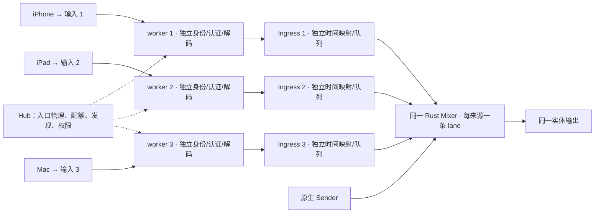

# NeonMix 多 AirPlay 设备接入与独立混音设计

日期：2026-10-02。状态：**已实施 macOS 功能 Alpha，数字多路验证通过；真实 Apple 并发及隐藏验收尚未完成**。配套文档：[开发计划](08_NeonMix_多AirPlay设备混音_开发计划.md)。

实施更新：本方案的身份、准入、IPC、发现、后台与桌面功能已落地；下面的检查差距保留原设计时点，不再代表现行代码。当前实现、分阶段证据及未关闭门槛见 [实现记录](docs/evidence/airplay/multi-source/implementation-20261002/README.md)。

同日补充：根据占用入口隐藏需求，增加“占用后撤下公开发现、释放后重新发布”的默认策略。协议与本地实现接缝支持此方向；Apple 原生列表消失、当前会话不中断仍须实机验证，详见 §5.4。

依据：[原接入设计](03_NeonMix_AirPlay接入_设计方案与技术选型.md)、[原开发计划](04_NeonMix_AirPlay接入_开发计划.md)、[实现状态](docs/STATUS.md)、[现行行为合约](docs/AIRPLAY-CONTRACT.md)、[IPC 合约](docs/AIRPLAY-IPC-CONTRACT.md)、[ADR-013](docs/adr/ADR-013-airplay-audio-worker.md) 和 [ADR-014](docs/adr/ADR-014-file-credentials.md)。本文仅替代原方案中未来多来源接入的范围与并发设计；现行代码、合约与已验收范围不会因文档保存而改变。

## 1 检查结论与实现差距

**现有方案没有“多个 AirPlay 发送设备同时接入本系统，并分别作为混音设备”的功能。** 它支持一个 AirPlay 来源与一路原生 Sender 混音；已配对多台设备、显示最近来源，都不等于同时接收多台设备的音频。

| 依据 | 检查结果 |
|---|---|
| 原设计 §1、§8 | 明确排除多个 AirPlay 发送端同时混音；第二来源连接返回占用，不抢占 |
| 原计划 §1、AP04、§7 | 初版只有单 AirPlay 和 1+1 混音，未安排多 AirPlay 工作包与验收 |
| `apps/hub/src/airplay.rs` | 单个 `State/Status`、单个 `source_id/source_name`、单 worker owner；`LANE = LANES - 1` 固定槽位 |
| `apps/hub/src/server.rs` | `airplay_mix: Option<LaneMix>`；AirPlay 活跃时限制原生活动来源数量不超过 1 |
| `apps/airplay-worker/main.cpp` | 单个 `Worker` 持有一份已验证来源、decoder、RTP 展开位置、协议音量和媒体 context |
| `crates/identity/src/speaker.rs`、`profiles.rs` | 当前 Speaker 身份从 Hub UUID 派生；一个 receiver profile 保存配对与播放方式 |
| `apps/desktop/src/pages/devices.rs`、`mixer.rs` | AirPlay 来源和调音行采用单条状态；设备列表不能完整表达多个活动来源 |
| 当前 Mixer 与 control | 有 16 个内部槽位/流上限，但不能据此宣称 16 路 AirPlay 可用；现行 AirPlay 配额仍是单来源及 1+1 |

`docs/STATUS.md` 已记录单路接收、设备展示、低延迟模式、暂停/换曲修订和文件凭证实施。原 03/04 顶部的“尚未实现”属于原编写时点，不能当作当前工程状态。多路设计应复用这些实现，不从零重做整个接收器。

## 2 产品目标与首期边界

多台 iPhone、iPad 或 Mac 无需安装 NeonMix，同时向同一个 Hub 发送不同音频。每台来源在设备页有独立记录，在 Mixer 有独立电平、增益、Mute、Solo、断开与撤销操作；与原生 Sender 共用一个实体输出。

### 2.1 接收入口与容量

采用 **一个 Hub 发布多个独立的 AirPlay 接收入口，每个入口占用时只接收一个来源**。例如：

| Apple 设备选择的目标 | NeonMix 设备记录 | Mixer 输入 |
|---|---|---|
| `NeonMix — 客厅 · 输入 1` | 小林的 iPhone · AirPlay · 输入 1 | 小林的 iPhone |
| `NeonMix — 客厅 · 输入 2` | 演示 iPad · AirPlay · 输入 2 | 演示 iPad |
| 原生房间连接 | Windows 笔记本 · NeonMix | Windows 笔记本 |

默认仅向新浏览者公开可用入口：一个入口建立活动会话后，Hub 撤下其公开发现；释放且重新可接入后，用相同身份恢复发布。第二台设备选择仍可见的空闲入口。系统缓存可能短暂保留旧目标，因此协议层仍须拒绝后来者，不能替换原会话或自动转发到其他入口。源端可见的是多个可用目标；“所有发送端都选同一个目标并自动分流”不在首期承诺中。撤下公告不是针对某台设备的可见性权限，不能保证任意未连接设备立即看不到，具体边界见 §5.4。

- 新建多路配置默认建立 2 个入口，可启用 1–4 个；只有管理员开启 AirPlay 后才监听和广播。
- 多路模式首期总活动输入上限为 4，包含 AirPlay、原生 Sender 和正在建立媒体的预留。支持目标包括 4+0、3+1、2+2、1+3、0+4；数字分别为 AirPlay 与原生输入数。
- 空闲入口和仅已配对的设备不占活动混音配额；暂停但协议会话仍有效的来源继续占用。
- 旧单路配置迁移后保留 1 个入口及原来的开关状态，管理员显式启用多路模式才采用新配额；不在升级时广播额外目标。
- 现有纯原生模式的技术上限不能误写成 2。切换到总上限为 4 的多路模式前，必须检查现有活动/预留数；超过 4 则拒绝切换，要求先主动减少输入，不踢掉已有来源。退出多路模式只能在受影响的 AirPlay 会话结束后执行，恢复既有原生配额规则。

4 路是拟验证的产品上限，不是已经测得的性能结果。16 个预分配 lane 保持，不将 UI 直接开放为 16 路 AirPlay。减少入口数量时只允许停用空闲入口，保留身份与配对供再次启用。

### 2.2 继续保留的范围

只接收音频；复用当前经典 UDP/NTP profile、实际支持的 44.1 kHz PCM/ALAC/AAC 路径及 48 kHz stereo 内部格式。不因多路功能宣称 AirPlay 2 buffered audio、PTP、多房间输出、视频接收或任意格式支持。

不同设备的音频按各自时间线混合，不承诺同一首歌在多台设备之间采样对齐。默认低延迟用于音乐；每路可独立选择 `synchronized`，视频仍在源设备显示，音画同步按原方案的具体 App/入口实测。

## 3 架构选择

| 路线 | 主要影响 | 决策 |
|---|---|---|
| 一个接收身份、一个 worker 内直接接收多来源 | 必须重构协议 owner、认证、decoder、时钟与事件路由，并证明 Apple 客户端不会抢占 | 不作为首期路线；现有实现没有此能力证据 |
| 多个独立接收身份、每入口一个音频 worker、同一 Mixer | 复用单来源协议模型，故障与流身份容易隔离；源端会看到多个目标 | **采用** |
| 每台来源启动一个完整 Hub，再回录声音 | 多份声卡 owner、总控与房间身份，增加路由和时延 | 不采用 |

固定 UxPlay v1.73.7 的上游文档要求同机多实例使用不同名称、设备 ID 与端口，命令说明也提供并发实例的设备 ID 设置。这支持多入口原型方向，但不是 NeonMix 已通过多路验收的证据。来源：[固定版本 README](https://github.com/FDH2/UxPlay/blob/v1.73.7/README.md)、[固定版本命令说明](https://github.com/FDH2/UxPlay/blob/v1.73.7/uxplay.1)。不依赖上游应用启动多个声卡播放器，而是使用项目已有的纯音频 worker。



Hub 仍是唯一房间、发现、worker 和声卡 owner。每个入口有独立控制管道、媒体 IPC、进程代际、停止标志、解码器和 Ingress。运行中一个 worker 故障只撤销该路；共享声卡丢失或 Hub 退出仍会影响所有来源。

## 4 身份、设备与持久化模型

必须区分“接收入口”“发送设备”和“本次流”，不能使用数组下标或设备名作为它们的共同 ID。

| 对象 | 主键与内容 | 生命周期 |
|---|---|---|
| `ReceiverEndpoint` | `receiver_id` UUID；稳定 `receiver_uuid/device_id`、名称、密钥引用、启用状态、默认播放模式 | 持久；改名、换网卡、进程重启不变 |
| `ExternalSource` | `source_id = SHA-256(规范解码后的已验证公钥)`；别名、最近名称、禁止/撤销状态、按设备保存的 trim/mute/播放偏好 | 持久；不写入原生 Principal/令牌表 |
| `PairingBinding` | `(receiver_id, source_id)`，配对记录及状态 | 按入口授权；配对一个入口不自动信任所有入口 |
| `AirplaySession` | Hub 授予的 `session_id/stream_id`、来源/入口、worker 代际、lane、epoch、映射、实际播放方式 | 运行期；重连创建新 session/stream |
| `AdmissionReservation` | 入口、已验证来源、请求/连接标识、代际、lane、过期时刻 | 运行期；成功转活动，失败或超时释放 |

实际客户端公钥使用 Base64 表示，复用当前共享校验和规范解码，不套用接收端发现公钥的 hex 格式。名称/IP/MAC 不授予身份。相同物理设备若在不同入口使用不同配对公钥，只能显示为不同已验证来源；允许人工设置别名，不自动合并权限或宣称可靠识别了同一硬件。

同一已验证 `source_id` 在房间最多有一个活动/预留会话，防止重复声音；换入口时先结束旧连接。不同公钥的重复物理设备不能依此自动去重，验收与说明需写明此边界。

### 4.1 保存与迁移

建议将当前 `airplay/receiver.json` 升级为闭合 schema 的 receiver profile v2，保存入口列表、来源/绑定、全局拒绝表、多路模式和容量策略；秘密仍在其父目录的 `.credentials`，使用 ADR-014 的权限、锁、原子替换和引用规则。新增入口分别生成随机长期密钥；不能从公开设备 ID 派生私钥，也不复制入口 1 的密钥给其他入口。

入口 1 必须沿用旧 Speaker 的 `receiver_uuid/device_id`、公钥/密钥引用、发现名称、known/blocked 集合和播放模式。新入口使用各自持久 UUID、不同 device ID/公钥与实例名；创建时检查本 profile 内 ID 冲突。旧客户端能继续选择原目标，旧名称不强制加“输入 1”后缀，UI 可另显示入口编号。

迁移在接收停止并持有 owner 锁时进行：验证原 profile/秘密 → 写新秘密并读回 → 构造 v2 → 原子发布。失败保留旧可用资料，只清理本次新建且未引用的秘密。未知版本、缺失密钥或损坏资料必须报错，不重建接收身份。设备总记录先限制 64 个不同公钥，绑定最多 4×64；撤销记录计入限额，满额时拒绝新增配对，不自动丢弃拒绝记录。

升级不自动恢复媒体或开启新入口。回滚使用显式导出入口 1 为旧格式的工具，保留当前入口 1 身份、相关配对和所有适用撤销状态；v2 有新配对/撤销后不能直接恢复旧快照。额外入口资料私有保留但不广播。迁移和回滚工具在开发阶段实现，本次不操作实际用户资料。

## 5 准入、配额与单路生命周期

### 5.1 统一配额事务

把 `airplay_mix: Option` 和固定 `LANE` 替换为有界会话表与统一 lane 分配器。原生和 AirPlay 的启动都在同一 Hub 权威事务中预留容量，不能分别读取计数后各自批准：

```text
活动输入数 + 建立中的预留数 <= 多路模式总上限 4
每个接收入口的活动数 + 预留数 <= 1
每个已验证来源的活动数 + 预留数 <= 1
```

仅广播的空闲入口不提前占 lane。原生 `Start` 与 AirPlay 的已验证 `admit_request` 共用预留机制；AirPlay 每入口最多一个媒体预留，暂定 5 秒到期，准入答复仍须满足当前 500ms worker 等待期限。首次 PIN 人工输入阶段不预留混音容量。完成媒体建立时重新核对权限、输出、代际和预留，再提交。

处理顺序为：验证来源和入口 → 原子预留 → 锁外准备资源/必要落盘 → 重查 reservation token 与权限 → 提交单份 Mixer 配置和权威状态 → 授予媒体 context → 确认 grant 后开本路 gate。失败先关闭 gate，再撤销预留/配置并回收资源；迟到的 `session_started` 不能重新占用过期预留。等待文件、worker 或进程退出时不持有 Hub 全局锁。

注册配对记录也必须绑定仍有效的原始请求和公钥；不允许迟到的 `registered` 覆盖已撤销状态。配对成功不代表还有播放容量，容量满时仍可保持已完成的信任记录，但不创建活动 Mixer 输入。

### 5.2 控制语义

| 动作/事件 | 范围与结果 |
|---|---|
| 设备自然停止/切回本机 | 清理本路 session 和 lane；保留配对。入口重新可接入且房间有容量后恢复公开发现 |
| 暂停/静音/非 Solo | 仍为已连接来源，保持占用隐藏，继续维护活性/时间线；不按“5 秒无媒体”踢掉 |
| 管理员断开设备 | 针对 `source_id + session_id`，关闭本路媒体并禁止该来源自动重入；其他设备保持 |
| 重新允许 | 解除该来源播放禁止；不恢复旧媒体、不自动发起连接 |
| 撤销设备 | 以已验证公钥为范围，撤销其所有入口绑定并加入房间拒绝表；关闭对应在途媒体 |
| 重新配对被撤销来源 | 管理员显式清除该来源撤销并开配对窗口；普通 allow 不恢复旧信任 |
| 停用一个入口 | 仅停该入口发现/监听/会话；设备配对保留；不能误用全局 stop |
| 关闭 AirPlay | 关闭全部入口；原生输入和实体输出继续按原规则运行 |
| 单 worker 故障 | 失效该进程代际和本路 grant，清队列、释放 lane，撤下该入口；其他 worker/原生保持 |
| 声卡丢失/输出 epoch 变化 | 全部活动 AirPlay 清旧媒体并结束会话；不更改配对。输出恢复后入口可就绪，源设备重新连接 |

单 worker 故障后不自动恢复旧会话；管理员可重试该入口，重新生成进程代际和 IPC token，长期接收身份保持。UI 关闭不影响任何 worker，退出后台按原有规则停止其拥有的 Hub。

### 5.3 配对与发现隔离

每入口有独立 PIN 窗口和尝试计数，UI 明确显示目标名称。继续采用 10 分钟、最多 5 次首次挑战；重试/重启入口不得绕过尚未到期的尝试限制，计数与窗口由 Hub 管理。全 Hub 同时进行的首次配对挑战暂限 4 个，超过则明确拒绝，避免按入口倍增无限握手。

Hub 在每个 worker 监听和 profile 检查就绪且允许新接入后，分别发布 `_raop._tcp`/`_airplay._tcp`。同入口的服务对使用同一实际身份，跨入口使用不同名称、device ID、实例和端口；原生 `_neonmix._tcp` 仍为一个房间。占用后按 §5.4 撤下该服务对，不通过改名、换身份或捏造 TXT 能力位隐藏；NeonMix 管理 UI 始终保留所有入口及占用情况。

RTSP 及 RTP/control/timing 端口由实际绑定结果确认，不能只区分 RTSP 端口。支持受控端口范围时，范围不足只使对应入口失败，不回退到占用其他入口的端口；范围与跨平台防火墙规则在首轮原型冻结。多网卡/IPv6 scope 复用当前发现修订。每入口独立运行目录、PEM、socket、日志和 GStreamer registry，运行时文件全部位于项目内。

### 5.4 占用入口隐藏：可行性调查与采用方案

**可行的是撤下占用入口的公共 Bonjour/DNS-SD 公告，保持实际会话运行；无法仅靠标准 mDNS 保证“只对未连接设备隐藏，同时对当前设备继续公开”，也无法强制清空 Apple 的界面缓存。** 因此采用“尽量使新浏览者只看到空闲入口”的产品行为，以客户端实测确定支持范围，不把不可见作为访问控制。

#### 调查依据（2026-10-02）

| 来源 | 可据此确认的事实及边界 |
|---|---|
| [Apple AirPlay 部署说明](https://support.apple.com/guide/deployment/use-airplay-dep9151c4ace/web) | Bonjour 通过组播发现，AirPlay 使用 `_airplay._tcp` 与 `_raop._tcp`；Apple 还存在 BLE/点对点等发现路线。本文只覆盖当前 NeonMix LAN Bonjour 路线，不新增这些旁路 |
| [RFC 6762 §10.1](https://www.rfc-editor.org/rfc/rfc6762.html#section-10.1) | 撤销记录可发送 TTL=0 的 goodbye；收到的解析器通常将缓存设为 1 秒后过期。这不是 Apple UI 必须在 1 秒内消失的承诺，丢包/休眠可延长残留 |
| [RFC 6763 附录 F](https://www.rfc-editor.org/rfc/rfc6763.html#appendix-F) | 服务浏览列表应随发现/消失更新，但不能由该规范推出所有 AirPlay 选择器都即时清除历史目标 |
| [Apple 注册注销接口说明](https://developer.apple.com/library/archive/documentation/Networking/Conceptual/dns_discovery_api/Articles/registering.html) | 注册可单独注销；关闭的是应用与发现 daemon 的注册关系。结合本项目的分进程架构，可将发现生命周期与 RTSP/RTP 会话生命周期分离；源端如何响应撤公告仍需实测 |
| [本地 Speaker 发布器](crates/identity/src/speaker.rs) | 发布 `_raop/_airplay` 的 owner 在 Hub，worker 不自行广播；已有 unregister 能力，但当前只封装在析构路径，需增加显式 publish/withdraw 状态 |
| [本地 mDNS fork](vendor/mdns-sd-scoped/src/service_daemon.rs) | `unregister_service` 生成 TTL=0 的 PTR/SRV/TXT/地址记录；`exec_command_unregister` 删除服务并安排约 120ms 后一次重发，覆盖 IPv4/IPv6。确认返回只代表本地命令执行，不代表远端列表已更新 |
| [本地记录 TTL](vendor/mdns-sd-scoped/src/service_info.rs) | 当前默认 host/SRV 为 120 秒、其他记录为 4500 秒；只停止定期公告可能留下很久的缓存，必须主动 goodbye。不会通过极短 TTL 轮询代替正确撤销 |
| [Hub 当前启动判定](apps/hub/src/airplay.rs) | `publisher.is_none()` 且启动超过 10 秒会报 `worker_ready_timeout`；不能直接清空 publisher 来隐藏，否则可能误判运行中的 worker 故障 |

上述结论来自协议/官方文档与源码检查，本次没有向用户当前房间发 goodbye、改变服务注册或取得 Apple 真机隐藏验证。没有证据支持用某个“busy” TXT 位让所有 Apple 选择器自动隐藏，也不按查询 IP 单播过滤来冒充按配对身份隐藏：其他设备仍可能收到组播和已有缓存。

#### 发布状态与转换

入口状态拆为 `receiver_ready`、`session_state` 与 `discovery_state`；其中发现状态包括 `published/withdrawing/hidden/publishing/error`，并记录 `visibility_reason`。隐藏不是禁用或故障；管理 UI 显示“已连接 · 已从发现列表隐藏”。

| 入口/房间状态 | 公告行为 | 协议与媒体行为 |
|---|---|---|
| 入口就绪、空闲、允许接入且房间有剩余容量 | 发布服务对 | 正常认证与准入 |
| 正在已获准的连接握手/预留阶段 | 本入口暂保留公告，防止建立阶段撤公告打断客户端；不能接受第二个 owner | 按既有 5 秒预留超时处理，不以隐藏替代准入锁 |
| 活动 session 已提交且 `grant_applied` 确认 | 撤下本入口两类服务及其登记的记录 | 保持 worker、RTSP/RTP/NTP、listener、decoder、映射和 lane；不等待出现非零声音才隐藏 |
| 已连接但暂停、静音、锁屏、换曲或 FLUSH | 保持隐藏 | 当前已认证会话及其协议操作继续；不因短暂无声重新广播 |
| 自然结束、断开或撤销后的清理中 | 保持隐藏 | 先使旧 context 无效并释放实际资源 |
| 清理完成且入口可接入 | 原身份/名称/密钥、实际监听端口重新发布 | 允许其他获准来源主动连接；原来源若被禁止/撤销仍被拒绝 |
| 总容量已满，但还有空闲入口 | 撤下没有进行中预留的空闲入口 | 拒绝缓存地址发起的新播放；已有预留/活动流不受影响 |
| 容量恢复、输出恢复、网络接口改变 | 按最新容量、占用和健康状态重新计算；只发布可接入入口 | 隐藏的活动入口不得因网络重公告意外出现 |
| 禁用、worker 故障或输出不可用 | 撤下受影响入口 | 按原生命周期处理，不因恢复公告复活旧媒体 |

隐藏完成以本地两个服务的注销状态确认，随后不再回答它们的发现查询；不把“发出请求”标为已隐藏。公开的管理 API 只报告 Hub 侧状态，不声明某台手机已经看不到。若注销失败，保持当前声音并标记 `discovery_state=error`，有界重试及记录原因，不能为了满足隐藏而杀掉当前 worker。

同一入口的两个服务对和所有已发布接口/地址族必须一起撤下，使用实际探测改名后的记录。每个入口使用独立 hostname，不能撤下其他入口或原生房间共用的 A/AAAA；不得关闭全局发现 daemon 或系统 Bonjour。给发布器新增显式方法，在专用非实时任务中等待确认，不在音频线程或持有全局锁时运行可能等待的 Drop。

发布/撤销按入口串行并携带 `visibility_generation`，异步完成时重查最新占用和容量。现有 fork 的 120ms goodbye 重发可能晚于一次快速重连后的重新发布：必须取消旧重发或按注册代际屏蔽旧包，防止新公告又被旧 goodbye 清掉；单纯在 Hub 里 sleep 一段时间不是完成判据。可对恢复发布做短暂合并以减少抖动，但不能重建身份，也不修改当前会话时序。

即使缓存让其他设备仍看到或直接访问入口，新的已验证来源也必须收到占用拒绝；当前 owner 的既有控制连接、必要的同会话附属连接与重复 SETUP 则按原会话认证处理，不能一律拒绝所有新 TCP。只有确认原 session 结束后才释放 owner，重新接入仍走配额事务。隐藏期间不阻断现有网络端口，不重置 PIN/配对/媒体 epoch。

#### 支持口径与验收

健康同子网网络下，暂定从活动提交到未连接设备的占用目标消失 P95 ≤5 秒，释放到重新出现 P95 ≤5 秒；这是新增实机目标，不是规范保证。同时测长期开着的列表、关闭后重新打开、从未连接的观察设备、曾配对但当前未连接设备，以及 IPv4/IPv6、多网卡、丢失 goodbye 和 Bonjour 网关缓存。

硬要求是撤公告不会导致正在播放的客户端停止、失去必要控制或不能暂停恢复；正常空闲入口保持可见；残留缓存不能造成抢占。若某 OS/App 路由因服务消失而断流，或未连接设备长期仍展示可选占用入口，该组合的隐藏能力判为未通过，不能用“抓包已发送 goodbye”替代。当前设备是否仍显示已选路由由源端决定，必须实测记录，不承诺为它保留一份私有 Bonjour 公告。

## 6 IPC、混音与时钟

### 6.1 IPC 演进

每个 worker 有自己的媒体连接和控制管道，不把所有 PCM 串进一个共享 FIFO。Hub 从已认证的连接对象绑定 `receiver_id + worker_generation`，不信任 payload 自报归属。

PCM 继续使用 v1 的 112-byte header 与最多 480 帧；`session_id/stream_id` 在全 Hub 原生与 AirPlay 命名空间内检查唯一，旧进程/会话/epoch 数据全部拒绝。控制 ID 继续限制 `1..2^53-1`，不重新引入 C JSON 大整数截断。

控制 JSON 升级为 v2（与 PCM 版本分别协商），启动/ready 握手必须一致；增加进程代际、请求对应的 `connection_id`，以及会话建立后的 `session_id/stream_epoch`。`session_started/registered/flush/volume/session_ended` 必须能匹配实际请求或活动会话，防止旧连接结束事件清掉下一台设备。新增 `grant_applied` 确认，媒体 gate 在正确 context 就绪后开启。断开、撤销、信任更新同样显式定向；全进程 stop 只由入口 owner 执行。

控制行仍有界为 16 KiB；按入口携带最多 64 个已验证公钥，新增字段需核对极限长度。版本不匹配使该入口不可用，不能降级到缺少来源上下文的旧事件语义。实现阶段更新正式 IPC 合约及 C/Rust 双向探针，本文不声称新字段已经存在。

控制与媒体是独立通道，不能假定 `grant_applied` 事件一定早于首个 PCM 抵达 Hub。Hub 先安装只属于该预留的校验 context，确认前的有效首包只进入有界待播、不得交给 Mixer；正确确认后才开 gate 并按期释放，确认超时则清本路队列并撤销预留。这样既不靠跨通道到达顺序授权，也不会因丢掉第一包而破坏首包时间映射。

### 6.2 每路独立调音与时间

每个 AirPlay session 独占自己的 Ingress、短 SPSC、lane、协议增益、连续 sinc、RTP/PTS 锚点、低延迟提前量和统计。所有 lane 只共享实体输出呈现时钟；A 的 flush、seek、重复 SETUP、换曲或时间断点不能重建 B 的 decoder、mapping 或补偿器。

默认 `low_latency` 继续按该路 epoch 首包确定固定提前量，保留当前 120ms 接收余量；`synchronized` 保留该路协议目标。不用最慢来源的等待时间统一延迟其他输入。每台设备播放方式可单独保存，只在该设备没有活动会话时修改；入口默认值仅用于没有已保存偏好的新来源。

有效增益沿用 `protocol_gain × input_trim × master_gain`，协议音量只应用一次。Solo 仍覆盖整个房间所有原生/AirPlay 输入：有 Solo 时仅未静音的 Solo 路可听，其他路仍消费时间线。多路加入不按连接数自动归一化，保持现有 limiter 和 5ms 渐变，避免加入一台设备使其他推子响度改变。

trim/mute 可按已验证来源保留；Solo 仅属于当前会话，断开即移除，不能污染下一台占用相同入口或 lane 的设备。新来源默认 0dB trim、未静音、未 Solo；恢复已知来源时只载入其自身偏好，房间总控保持。

### 6.3 资源与公平性

| 资源 | 首期约束 |
|---|---|
| worker | 最多 4 个已启用入口，一个入口一个进程；未启用不启动 |
| 定时 ingress | 每活动 AirPlay 最多 4 秒且 2 MiB，4 路合计最多 8 MiB，包含队列块与元数据；不是整进程 RSS 上限 |
| PCM header/payload | 保持当前单包最多 3952 bytes；不按不可信长度分配 |
| PCM 短 SPSC | 每 lane 仍为 8×480 帧；不扩大原生水位/FIFO |
| 解码与发送缓存 | 每 worker 沿用有界 appsrc/appsink、发送队列与元数据队列，按 4 实例列出总预算；不只计算 ingress |
| 来源与绑定 | 最多 64 个来源、256 个绑定；历史/拒绝记录和 API 响应均有界 |
| 实时回调 | 继续固定槽位、无锁等待、无 IPC、无分配/析构；增删只提交配置 |

当前每路 Ingress 会预留容量，启用入口不应无条件创建完整媒体状态；尽量在获得配额后构建，测量空闲 1/2/4 个 worker 的实际成本。四路 48k 双声道 F32 净 PCM 约 1.536 MB/s，仅是 IPC 负载估算，不等于总网络流量或资源保证。

每路专用非实时媒体执行单元负责解码交接与释放，诊断非阻塞发布。共享控制调度采用按入口有界批量处理，不能无穷读完 A 才轮到 B；Hub 全局锁只保护短事务。控制/媒体/日志消费者阻塞时只终止对应 worker 或丢统计，不能拖住其他来源。

全机墙钟映射失效可能同时影响多个 Ingress，不能将其误算为单 worker 故障。输出时钟、声卡和主混音器仍是公共故障域，诊断应区分公共事件与单来源重建。

## 7 API 与桌面交互

新增 `/v2/airplay`，使用现有 HTTPS/Bearer 与管理员写权限。读模型提供 `receivers[]/sources[]/sessions[]/capacity`，每条 session 包含入口、来源、stream ID、播放方式、mix 和时间统计；receiver 分别公开就绪、占用和发现状态及隐藏/失败原因。sources 是持久配对设备清单，sessions 是当前活动输入，统计“已连接”不能把两者相加。

写命令建议形态（示意）：

```json
{
  "command_id": "UUID",
  "expected_revision": 27,
  "operation": {
    "action": "mix_source",
    "source_id": "sha256:…",
    "session_id": 123,
    "gain_db": -6.0,
    "muted": false,
    "solo": false
  }
}
```

复用单个 AirPlay 权威 revision，原生 revision 仍独立；电平、队列统计不递增控制 revision。所有写入明确 `receiver_id`、`source_id` 或全局动作，不接受“当前设备”隐式目标。影响活动媒体的命令必须匹配 `session_id`，防止网络延迟把上一会话的操作用于新会话。`command_id` 做有界重试去重，同 ID 不同内容拒绝；持久操作重试应幂等，进程重启不重放媒体动作。

错误至少区分 `receiver_busy`、`room_capacity_full`、`source_already_active`、`source_blocked`、`pairing_revoked`、`stale_revision`、`session_changed`、`output_unavailable`、`worker_unavailable` 与 `upgrade_required`。这些是 NeonMix 控制/API 错误；Apple 侧协议返回的失败及实际提示需按实机记录，不承诺能显示这些自定义文案。

v1 API 在旧单路模式保留原语义；多路模式下 v1 返回明确的升级要求，不将无目标 `disconnect/revoke/mix` 随机映射到第一台来源。新版后台/UI 使用 v2；旧客户端进入多路模式不得误调其他设备。PIN 只在管理员交互读模型显示，诊断与普通成员快照不含 PIN/公钥原文/秘密。

桌面沿用当前房间结构和 [DESIGN.md](DESIGN.md)：

- **房间设置**：AirPlay 总开关、入口数量、每个入口的名称、就绪/占用/故障、配对窗口与公开/隐藏状态；占用入口留在管理界面。总容量单独显示，避免把入口数误解为已连接设备数。
- **设备页**：每个已验证来源一行，显示 AirPlay 标记、当前入口、连接/暂停/禁止/撤销状态；支持离线来源的允许与撤销。活动设备优先，离线配对记录保留。
- **Mixer**：每个活动来源一行，电平通过 `stream_id → lane` 映射；独立 trim/Mute/Solo 和可见播放方式，与原生行共同参与总控。按稳定 source/session ID 保持 UI 状态，不用行号缓存推子或命令。
- **并发操作**：写入冲突只刷新相关权威状态并保留用户最后意图，重试前检查来源/会话仍相同；撤销/断开不随新会话自动重试。一个入口加载或失败不能使整个 Mixer 禁用。
- **诊断**：逐来源显示收包、迟到、重建、队列、漂移、worker 故障及容量占用；标明软件估计与实际音画测量的区别。

## 8 验收边界与完成定义

交付至少证明：两台真实 Apple 设备同时各选一个目标并持续播放；两条独立波形到达同一输出；逐路音量/Mute/Solo/断开/撤销有效；其他输入保持。完整 4 路支持还需 4 个真实来源同时播放，不能仅靠循环建立配对或合成客户端宣称达成。

自动化以不同频率/脉冲标记验证 4+0、3+1、2+2、1+3、0+4 的混音归属和控制影响；对某一路注入 flush、重复 SETUP、暂停恢复、曲间空档、IPC 堵塞和进程退出，检查其他路没有 epoch 重建、额外欠载或错误增益变化。对所有会话之间的错身份、错 lane、旧事件和旧 PCM 做交叉拒绝测试。

竞争用例必须包含“最后一个名额同时收到 AirPlay 与原生 Start”“同一来源同时抢两个入口”“准入超时后迟到开始”“撤销同时配对/重连”“lane 复用后旧事件抵达”。这些不能只用顺序脚本验证。

目标平台仍为 macOS arm64、Windows 11 x64、Ubuntu 24.04 x86_64。先交付 macOS 多路 Alpha，再按原方案补齐跨平台 worker、权限、安装与真实来源矩阵。单机合成测试、ARM64 VM、单来源可听记录分别报告，不替代目标平台多设备验收。

每个平台在固定制品上完成 8 小时健康网络连续播放和 24 小时资源/反复连接长测；上限 4 路至少覆盖 4+0 与 2+2，详细分配见计划。视频伴音继续只在 `synchronized` 的声明支持场景按原 P95 ≤50ms 目标实测；低延迟模式不作此承诺。原计划尚未通过的许可、正式分发和 App 兼容项继续保留。

## 9 实施落点与决策门

| 落点 | 主要改动 |
|---|---|
| `apps/hub/src/airplay.rs` | 拆出入口管理、会话/来源表、单 worker owner；移除单例状态与隐式当前来源 |
| `apps/hub/src/server.rs`、`crates/control` | 共用容量预留、lane 所有权和一次 Mixer 配置提交，覆盖原生启动竞争 |
| `crates/airplay-adapter` | 每 session Ingress 与模式；v2 控制 DTO、容量和诊断摘要 |
| `crates/airplay-ipc`、`apps/airplay-worker` | 定向控制 v2、事件上下文、grant 确认；PCM v1 和纯音频边界保持 |
| `crates/identity`、隔离 mDNS fork | 多入口稳定身份、显式发布/撤销、旧 goodbye 重发隔离；profile v2、来源绑定、文件凭证迁移与回滚 |
| `crates/desktop-service`、`apps/desktop` | 多路状态/API、设备和 Mixer 多行、逐设备操作、稳定电平映射 |
| `tools/airplay_*`、worker 探针 | 多实例数字源、真实来源步骤、并发/隔离/上限负载证据 |
| 现有行为/IPC/桌面合约与 ADR | 实施时更新接口、配额和实际差异；新 ADR 状态按已验证结果填写 |

首个决策门是“两台真实设备通过不同稳定接收身份同时向同一 Mixer 供声，且占用入口撤公告不影响当前播放，并在未连接观察设备上消失”。未通过前不把入口列表 UI 或仅协议注销成功当作功能完成；若多实例发现/配对/隐藏/纯音频接缝不可行，先记录根因并修正路线，再推进全面集成。
