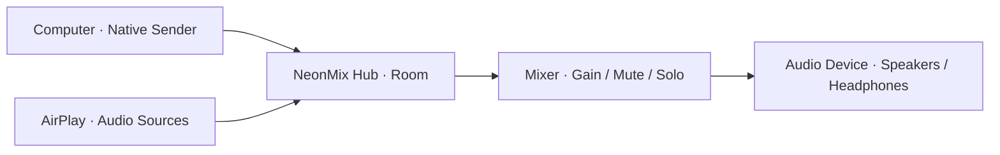

<div align="center">

# N E O N M I X

### Many sources. One mix.

Bring the sound of your local network together.


**English** · [简体中文](README.zh-CN.md) · [Build](#build)

</div>

---

## Meet NeonMix

**NeonMix is a cross-platform local-network audio hub built in Rust.** It brings native computer senders and AirPlay audio into a shared room, gives each source a channel on a desktop mixer, and plays the mix through your chosen audio device.

Bring your work computer, music from another device, and multiple audio sources into one workflow: discover a room, pair, start sending, and shape the mix.

| | What you can do |
|---|---|
| **◉ Bring sources together** | Send computer audio with a native Sender or receive AirPlay audio, with separate channels for each source. |
| **≋ Shape the mix** | Adjust per-channel gain, mute and solo, watch channel levels, and control the room’s master output. |
| **⌁ Connect locally** | Discover rooms on your network, pair through one-time invitations, and manage connected devices. |
| **◇ Make it your desktop** | Choose light or dark appearance, switch between English and Chinese, and work with keyboard shortcuts. An independent background service keeps audio running when the window closes. |

### Your first mix

1. Open NeonMix on the receiving computer, choose an output device, and enable room sharing.
2. Discover and pair with the room from a sending computer, then start sending. For AirPlay, select the room’s receiver entry.
3. Open Mixer to balance channels, mute or solo individual sources, and set the master volume.

### How audio flows



The desktop interface handles control while an independent background service handles audio. Rooms, devices, and mixer state are organized around the same audio workflow.

## Build

Use Rust **1.95.0**, your platform SDK and C/C++ build tools, and Python **3.12+** for development scripts. Linux uses a PipeWire desktop session. The project wrappers keep dependency caches and build output inside the repository.

### macOS

```sh
tools/dev python3 tools/prepare_gstreamer.py
tools/dev cargo build --workspace --release --locked
tools/dev target/release/neonmix-desktop
```

### Windows · PowerShell

```powershell
./tools/dev.ps1 python tools/prepare_windows_gstreamer.py
./tools/dev.ps1 cargo build --workspace --release --locked
./tools/dev.ps1 target/release/neonmix-desktop.exe
```

### Linux · Ubuntu 24.04

```sh
tools/dev sh tools/prepare_linux.sh
tools/dev cargo build --workspace --release --locked
tools/dev target/release/neonmix-desktop
```

The AirPlay receiver is a separate CMake worker. On macOS, build it with `tools/dev python3 tools/prepare_airplay.py`. See the [macOS workflow](.github/workflows/macos-installer.yml) and [Windows workflow](.github/workflows/windows-installer.yml) for native dependencies and installer assembly.

### Inside the project

| Path | Purpose |
|---|---|
| `apps/desktop` | Desktop room and mixer interface |
| `apps/hub` | Hub and Sender CLI |
| `apps/audio` | Audio devices and probes |
| `apps/airplay-worker` | Dedicated AirPlay receiver worker |
| `crates/audio-core` · `crates/audio-io` | Audio processing and native I/O |
| `crates/media` · `crates/control` | Media transport and room control |
| `crates/identity` | Discovery, pairing and identity |
| `crates/desktop-service` | Background service and lifecycle |
| `adapters` · `drivers` | Platform audio integration |
| `tools` | Development, builds and verification |

```sh
# Inspect the development environment
tools/dev python3 tools/doctor.py

# Run project checks
tools/dev python3 tools/check.py
```

---

<div align="center">

**Your devices. Your sound. Your mix.**

</div>
