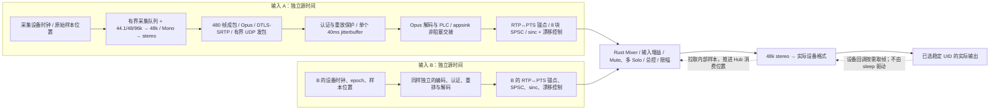

# E02–E04 媒体与控制合约（v1）

## 2026-10-07 幂等准备与完整回执

P02 增加 `Snapshot.runtime_epoch`：每次 `Authority::new/restore` 生成新的 UUID，持久 state 不保存它。原生 `Command` 的可选 `runtime_epoch/credential_id` 在认证后、回执查找/CAS/准备之前校验；当前 Desktop 必须携带它们，运行代次不符返回 `snapshot_required`，身份不符返回 `unauthenticated`。旧 CLI 省略条件字段继续保留原接口语义，不获得跨重启对账保证。事件携带同一 runtime，`Snapshot::apply_event` 拒绝旧 runtime，即使 Hub UUID 和数字 revision 碰巧一致。P07 Native版本域见下文；AirPlay仍在其独立版本域中逐步迁移。

`Authority::prepare_transaction` 明确返回 `Preparation::Replay(Receipt)` 或 `Preparation::Prepared(PreparedCommand)`。首先重新核验当前身份，再按身份和 `request_id` 查已完成请求；相同 ID 的 operation、目标、expected_revision 或 payload 变化返回 `idempotency_conflict`。已完成重放先于无关 pending 的 Busy 判断。

Hub 原生 HTTP 命令在 Replay 分支立即返回首次 `StartResponse`，不执行资源预留、SDK/媒体准备、证书解析、保存或 Mixer 配置发布。完整响应和权威提交在同一 Engine 临界区记录，回复丢失后仍可重放原 session、port 和 certificate fingerprint；原会话结束不影响历史回执，也不会因重放复活。已撤销身份不能读取旧敏感响应。

缓存最多 128 条、仅限当前进程；Authority 有回执但 HTTP 完整响应不可得时返回 `snapshot_required`，不重建历史结果。重启后的 runtime 识别、缓存过期的 Unknown 对账和耐久中间态由后续版本补充，本批不提供跨重启 exactly-once 保证。

实现入口为 `neonmix-hub`；公共模型在 `crates/control`，媒体适配在 `crates/media`，实时混音在 `crates/audio-core/src/mixer.rs`。此合约冻结本轮实验接口；自动发现、首次配对界面、系统凭证保护和成品安装分别属于 E05/E07/E09。

## 身份、协商与生命周期

控制仅使用 TLS 1.3 HTTPS/WSS。客户端读取明确提供的凭证文件，验证其中的 Hub 证书及主机名，不关闭证书校验。`init --host` 将局域网地址或 DNS 名加入证书 SAN；默认仅包含 localhost 和两种 loopback 地址。`init` 创建高熵实验凭证，文件权限为 macOS `0600`，拒绝覆盖已有文件。它是明确的实验引导，不是系统 Keychain 的静默替代。

Bearer 凭证的 SHA-256 映射到服务端 Device 和 Role；请求不能自报身份或权限。Hub 的 `device_id` 为 UUID，与地址、设备名和 SSRC 无关。`session_id`、`media_context` 每次创建均为新 UUID；`stream_id` 为 1…2⁵³−1 的整数，JSON 客户端可精确表示，内部音频块仍采用 u64。

Start 的媒体 offer 字段如下，未知字段和错误类型拒绝：

| 字段 | 类型与允许值 |
|---|---|
| `version` | u16，必须为 1；其他版本返回 `incompatible_version` |
| `codec` | 字符串 `opus` |
| `rate` / `channels` / `packet_frames` | 分别为 48000 / 2 / 480 |
| `payload_type` / `ssrc` | 分别为 96 / 非零 u32 |
| `stream_epoch` | 非零 u64；采集时间线或格式断点必须建立新上下文 |
| `udp_port` | 1…65535，Sender 的本地 UDP 端口 |
| `certificate_sha256` | 对端 DTLS 叶证书 DER 的 SHA-256，64 个小写十六进制字符 |

该 offer 经认证控制通道绑定到 Device、Session、Stream、epoch 和 SSRC。Hub 从真实 TLS socket 获得发送端地址，连接 UDP socket 到相应地址/端口；Sender 从已验证的 HTTPS 响应取得实际 Hub 地址，因此支持 IPv4 和 IPv6，不另做可能选中其他接口的 DNS 猜测。

媒体用 GStreamer/OpenSSL DTLS 协商及 libsrtp SRTP/SRTCP。证书指纹匹配和 DTLS `connected`/密钥就绪须同时满足，之后才发送音频、接受明文 RTP 或反馈；PCM 交接再检查授权。撤销门不可被后续证书通知重新打开。握手最多 5 秒，安全上下文最多 86400 秒，设备撤销、会话终止、DTLS 失败或超时会关闭上下文。重新建立必须使用新协商密钥，不能仅修改 epoch 或清零包计数。密钥、PEM 私钥与凭证不进入应用日志或事件；错误仅导出消息，不导出 GStreamer bus 的 debug 内容。

原生 RTP 时间钟固定 48 kHz，每个 10 ms Opus 包增量 480，立体声不乘二。发送端用编码样本计数统一 RTP 时间，避免 Opus 编码前瞻的首包偏移造成 168 帧步长；编码断点关闭当前上下文。正常初始序号随机选下半区，避免首包丢失跨回绕的 SRTP ROC 歧义；受控原点用于真实回绕测试。序号和时间戳扩展为 u64，向前与乱序包均按序号差校验模 2³² 时间钟；错误乱序包不消耗接收窗口、不推进最高时间戳。首次收到回绕后的包时，较早的回绕前包仍可正确校验。认证、加密和重放窗口由成熟库执行，自有 128 包窗口仅补充诊断与格式检查。

## 队列与两路时钟

两路数据及等待职责如下；其余槽位与 A/B 相同，每路拥有独立解码器、缓冲和漂移状态。



RTP 是发送源的采样时间；jitterbuffer 使用接收管线 PTS 决定包期限。在 jitterbuffer 输出后，以首包 PTS 为原点，按扩展 RTP 的精确 48 kHz 源样本位置重建解码 PTS；同时把丢包事件的 timestamp/duration 对齐同一源钟。接收时钟的 skew 不进入解码样本位置。解码 PCM 通过有界 RTP/PTS 锚点表还原源位置，PLC 没有 RTP 包时按实际解码帧数推进。远端原始采集时钟未传输，`capture_timestamp_ns=0` 表示未知，不把 PTS 冒充采集测量。不同源的位置不能直接相减。

| 层 | 上限/目标 | 满、空和等待策略 |
|---|---|---|
| 原生采集 SPSC | E01 的 32 块，100 ms 最大年龄 | 回调不等待网络；过期清理或丢失时间线时发送端终止并要求新上下文 |
| 采集转换/成帧 | 256 原生帧 sinc chunk；480 内部帧 | 44.1/96k 名义转换在采集工作线程；转换延迟单独报告 |
| 编码 appsrc | 4 块、15360 字节，约 40 ms | 不阻塞，丢旧；编码断点不压缩成连续源时间 |
| 加密 wire appsink / UDP pacing | 8 包 / 8 个待发包 | 满时丢旧，UDP 非阻塞；正常每 10 ms 发一包，编码突发时按 1 ms 间隔有界追赶，DTLS 不受音频节奏限制；CLI 测试源每轮最多追赶一块，积压超过 80 ms 则关闭上下文，不能跳过源时间后继续伪造连续 RTP |
| UDP 接收 / wire appsrc | 每路 200 包/秒；32 包、128 KiB | 每个固定 1 ms 窗口最多读 32 包；耗尽时临时注销 socket 可读事件，native 唤醒不会绕过预算；RTP/SRTCP ≤1200 字节、DTLS ≤4096 字节 |
| jitterbuffer | 唯一一个，40 ms 缺包期限、独立 32 包认证在途上限、`drop-on-latency=false`、`do-lost` | 重排、明确迟到/丢失；关闭重传。容量从认证后到 jitter 输出或 loss 事件退役按扩展序号跟踪；耗尽则撤销当前会话，不能把队列 RTP 跨度当作迟到条件 |
| 解码 appsink | 8 个 buffer、80 ms、368640 字节；最大单次音频 5760 帧 | `sync=false`、`processing-deadline=0`；及时交接，不等待接收管线时钟。jitterbuffer 单独负责缺包期限，Mixer 按设备消费。满时丢旧，诊断报告实际丢弃 |
| 解码交接暂存 | 最多一个合法样本，5760 帧 / 12 块 | 按 SPSC 空闲槽转交；未交完不继续拉取下一样本，保留到达时间，不增加播放水位或绕过原有新鲜度限制 |
| PCM SPSC / lane FIFO | 8×480 帧、80 ms 年龄 / 4320 帧 | generation 清旧；输出端有限读取，不等待 appsink；不足时静音并重新缓冲 |
| 每路 sinc | SincFixedOut，480 输出帧，预分配 | 动态比率；启动至少 `input_frames_next + 2880`；水位目标 3360 帧（70 ms，含当前输出块） |
| 音频控制 | 8 个固定大小配置 | 在 480 帧边界应用；满时 `busy`，状态不提交 |

Sender 与 Hub 的媒体泵使用 socket 就绪与 GStreamer appsink 就绪事件唤醒，HTTPS/WSS 快照与订阅由独立 Tokio workers 推进。源时钟、发包和状态发布分别保留期限；macOS 通过 kqueue 的单次 `NOTE_CRITICAL` 定时器减少期限合并。采集仍最多每 1 ms 检查一次原生队列；解码与收包达到单轮预算时用 1 ms 期限继续处理，保证边沿触发下仍会再次检查未读数据；单轮最多 32 包，每秒最多 200 包进入接收管线。Sender 运行统计通过容量 2 的非阻塞诊断队列交给独立写线程；消费者变慢时丢弃统计并计入 `diagnostic_drops`，不阻塞采集/发包。

macOS Sender 和每个活动接收线程在非实时路径持有 `NSProcessInfo` 的 `UserInitiatedAllowingIdleSystemSleep | LatencyCritical` 活动 token，结束/错误时由 RAII 释放；媒体线程使用普通分时 `SCHED_OTHER`、基础优先级 47；macOS CLI 的应用角色可能把 QoS 请求限制为实际 31，因此不再把 QoS setter 成功视为调度已生效。通过 `thread_info` 核对实际策略与基础优先级。原生 streaming thread 的 ENTER/LEAVE 与 Rust guard 保持生命周期一致，退出时恢复原有策略和基础优先级；显式 pthread 调度会退出 QoS 模型，仅限独立媒体线程，不应用于 UI/Dispatch executor。空闲 Hub 没有媒体活动，显式休眠仍允许发生。活动用于声明正在进行的音频工作，不扩展回调线程权限；周期统计发布使用非阻塞锁；诊断读取可短暂等待报告锁，不参与音频回调。参考 [Apple 活动生命周期](https://developer.apple.com/library/archive/documentation/Performance/Conceptual/power_efficiency_guidelines_osx/PrioritizeWorkAtTheAppLevel.html)。

容量上限不是每层都会固定停留的时间。端到端延迟还包含设备周期、转换/编码前瞻和实体输出，不将 RTT、PTS 或估计水位命名为已测模拟端延迟。

历史普通媒体线程曾停顿约 60 ms，扩大水位后仍失败，因此缓冲不能代替调度修复。当前 Mixer 在 sinc 取样后保留至少 2880 帧源数据，并有 480 帧当前输出块。目标调整为 70 ms，FIFO 最大 4320 帧，SPSC+FIFO 总上限 8160 帧；异常不靠无限积压恢复。该调整增加约 10 ms 缓冲预算，实际模拟端延迟仍须独立测量，未据估算宣布 E1 延迟达标。拥塞水位阈值为目标加两个包（4320 帧），保持正常包量化余量。

漂移控制按源样本进度、输出消费位置和滤波水位计算：5 秒斜率窗、30 秒估计滤波、2 秒水位滤波，比率补偿 ±1000 ppm、变化速率 50 ppm/s。断点和输出 epoch 变化清状态。±100/±500 ppm 的 600 秒注入检验实际 sinc 路径、水位、欠载、频率和 RMS；这是已测实验范围，不是任意设备保证。

历史 `drop-on-latency` 的容量丢弃未必产生原生丢包事件；现已关闭此按 RTP 跨度驱逐的策略。输出处仍防御性检查下一源位置与已送入解码/PLC 的位置；短缺口最多 5760 帧（120 ms）通过补发对齐的 `GstRTPPacketLost` 进入同一个 Opus 解码器，不重复掩蔽已有事件。`overflow_plc_packets` 单独记录这种缺口，并计入丢包反馈；更长缺口保留断点，由 Mixer 清旧数据后重新缓冲，不制造无限掩蔽。`jitter_queued_packets` / `jitter_peak_packets` 是当前 / 峰值认证在途包数，`jitter_capacity_exhausted` 表示独立容量上限已耗尽；正常缺包仍由原来的 40 ms jitter 期限处理。

每秒发送经 SRTCP 保护的 compound RR + `NMX1` APP 反馈，包括丢包、迟到、水位与接收状态。水位采用 Mixer 的两秒滤波值，避免把正常包突发当作持续拥塞；诊断同时公开 `queues` 原始水位和 `filtered_queues`，Sender 的 `last_feedback` 是实际解密接收的最近一条反馈。三次持续不良反馈降码率，从 192 kbit/s 降至 64 kbit/s；严重拥塞后暂停内容并发送静音/DTX，以保留恢复反馈，五次正常反馈逐步恢复。用户停止、管理员禁止和撤销不会被此恢复覆盖。无音频重传和第二套正式 PCM 传输栈。

## 混音、恢复与资源

每路独立输入 gain、Mute 和多 Solo；没有 Solo 时所有未静音流可听，有 Solo 时仅未静音的 Solo 流可听。静音/非 Solo 路继续消费与补偿时钟。0 dB 为 unity，−96 dB 为滑块零点（精确零），范围 −96…+12 dB。新连接不改变其他输入的增益，不按连接数归一化。输入/总控固定 240 个内部帧（5 ms）渐变，从当前增益插值到目标；每路在 PCM 可消费前保持恢复 envelope，不用缓冲期的补零提前完成淡入，移除流先清旧数据并衰减最后样本约 5 ms。输出 limiter 顶值 0.98、即时攻击、约 50 ms 释放；诊断公开实际限幅帧数。

最多 16 个音频槽位，SPSC、FIFO 和 sinc 在控制线程预建。回调没有 Tokio、GStreamer、磁盘、锁等待或对象回收；使用固定大小配置切换，移除时保留槽位内存。Native stream 的 owner 在控制线程回收 Mixer，输出丢失时清积压；每秒只重试原 UID，恢复后更新输出 epoch 并淡入，不转到系统默认输出。即使输出缺失，HTTPS 控制与有界接收仍可运行。

## 权威 API、权限与版本

| 接口 | 行为 |
|---|---|
| `GET /v1/hub` | Hub/Bus/Output、Devices、Sessions、Streams 和 revision 的完整快照 |
| `GET /v1/devices` / `streams` / `outputs` | 相应权威对象；outputs 为当前固定的单输出 |
| `POST /v1/commands` | 以下所有版本化操作的统一事务入口 |
| `POST /v1/sessions` | 同样的命令 envelope，Sender 用于 Start |
| `GET /v1/events?after=REV` | WSS；返回严格递增的状态增量，最多保留 256 条事件 |
| `GET /v1/diagnostics` | 每路认证/包/PLC/PCM、水位与漂移，输出回调/时钟、限幅与错误 |

原设计的 PATCH/DELETE 表为草案。本轮采用单一命令入口统一幂等和冲突语义，不额外维护第二套写接口。例：

```json
{
  "request_id": "42b0f20f-8421-4c01-a7e5-1eed5f4f11ab",
  "expected_revision": 42,
  "operation": {
    "type": "stream_mix",
    "stream_id": 123,
    "gain_db": -6.0,
    "muted": false,
    "solo": null
  }
}
```

| operation.type | 参数 | 权限 |
|---|---|---|
| `start` | `offer` | 已授权且未禁止的 Device；每设备一个活动会话 |
| `stop` | `session_id` | 仅自己的会话；终态 `user_stopped` |
| `stream_mix` | `stream_id`，可空的 `gain_db`/`muted`/`solo` | 成员仅自己的 gain/Mute；任何 Solo 修改都须 controller/admin |
| `output_mix` | 可空 `gain_db`/`muted` | controller/admin |
| `register_device` | `name`、`role`、`token_sha256` | admin；写入认证映射，返回新 device_id；凭证原文不入状态 |
| `disconnect` | `device_id` | admin；终态 `admin_disconnected`，禁止重连 |
| `allow_playback` | `device_id` | admin；仅重新允许，既不重新启动 Sender，也不恢复旧会话 |
| `revoke` | `device_id` | admin；认证立即失效、会话终态 `revoked`；不能撤销最后一个管理员 |

JSON 错误类型/未知字段由 Axum/Serde 拒绝，Body ≤16 KiB。模型错误响应 `{"error":"CODE"}`：401 `unauthenticated`，403 `permission_denied`/`playback_blocked`，409 `revision_conflict`/`idempotency_conflict`/`already_active`，404 `not_found`，429 `quota_exceeded`，503 `busy`，400 `invalid_argument`/`incompatible_version`/`snapshot_required`。失败客户端应保留旧显示并取新快照；不要把冲突值盲目重试。

幂等键为认证 Device + request_id，最近 128 个成功命令保留原结果；同 ID 改参数返回冲突。版本不匹配不提交；revision 耗尽时，命令和内部会话/输出状态变更都返回 `quota_exceeded`，不留下未标版本的状态修改。实验 Sender 只对尚未成功的 Start 版本冲突重新取快照，最多三次。API 状态包含 `buffering`、`playing`、`network_degraded`、`user_stopped`、`admin_disconnected`、`network_interrupted`、`revoked`、`output_lost`；Mute 是独立 mix 字段。认证后按 Opus TOC/帧数检查实际包时长必须为 480 帧，再进入 RTP 时间线与 jitterbuffer；PLC 的聚合时长仍由独立丢包事件处理。完整 bitstream framing 与解码继续由原生 libopus 验证。仅认证且格式有效的 RTP 更新活性，5 秒无媒体终止会话，损坏 UDP 不能冒充活性。

事件包含 `revision`、`hub_id`、修改的 `devices`/`sessions`/`streams`、`removed_streams`/`removed_sessions`、可空 `output`。客户端先取快照，按对象 ID upsert 修改项、删除移除项、替换非空 output，再更新 revision；不连续或游标过期时重取快照。最多 8 个订阅，写缓冲 256 KiB，普通事件、错误与 Close 帧的发送均有 2 秒超时；慢客户端不会永久占用订阅槽位。回放批次中每条事件发送前重新认证，撤销后的订阅关闭。诊断瞬时统计不为每个音频包生成状态事件。

持久化为本轮内部版本化 JSON，包含 Hub ID、设备信任/撤销/播放许可、凭证哈希和 gain/Mute 偏好；不保存会话、SRTP 状态、PCM、瞬时电平或 Solo。一个状态文件只允许一个 Hub owner。提交先检查单生产者音频队列容量，并准备原生管线及休眠的媒体线程；线程创建失败返回 `busy`，不移动生产者、不落盘、不发布音频配置。原子落盘成功后发布音频配置、激活媒体线程并提交权威事件；落盘失败释放准备资源，原生产者和配置保持不变。活动期间统计发布使用非阻塞锁；终态先关闭授权并使未消费 PCM 失效，再可靠发布 `network_interrupted`，不能因诊断读取繁忙而遗漏终态。终态会话历史最多 256 条，淘汰最旧终态不会阻止新连接。SQLite/平台凭证适配属于后续产品化，内部存储不作为客户端接口。

E06 绑定客户端补充：session StartResponse 现在带服务端 `hub_id`，来自同一次权威状态；旧未绑定实验客户端仍可忽略该字段。`send --output-binding` 在快照、协商响应、冲突刷新及运行中的控制快照中校验绑定 Hub UUID。详见 [输出绑定合约](OUTPUT-BINDING-CONTRACT.md)。


## 媒体停顿诊断

Sender 的 `media_scheduling` 与 Hub `media_workers[].scheduling` 记录初始化时实际的 `policy`（macOS `1` 为普通分时）、`base_priority`、`configured` 和错误码；`native_scheduling` 记录 GStreamer 各 streaming thread 的进入、配置失败及基础优先级范围。这些是配置验证，不保证后续每次调度满足期限。

`pump_timing` 为收包、源处理/解码交接、发包、反馈、报告、等待分别保存最大墙钟耗时及同一观测的线程 CPU 时间，并保留最多 8 个最近异常。等待记录请求时长和 `max_wait_lateness_ns`；正常 10/20 ms 等待不计为停顿。非 macOS 的 CPU 时间为 `null`，不伪造为零。观测仅在非实时媒体线程运行，音频回调不增加系统调用或日志。故障统计在关闭媒体授权后写出。

长跑探针固定每次测试的两个二进制，记录 Hub/两路 Sender 的 RSS、physical footprint、线程数和文件描述符。CPU 百分比按一个逻辑核满载为 100%，峰值是采样间隔均值的峰值，不冒充瞬时峰值。loopback 长测另外要求丢包、迟到、实际 PLC 样本均为零，避免掩蔽代替连续性。跨机/模拟端延迟与 8/24 小时验收另行记录。

Opus 时长检查依据 [RFC 6716 §3.1–3.2](https://www.rfc-editor.org/rfc/rfc6716.html#section-3.1)，支持等价的 2.5/5 ms 聚合帧，不要求编码内部一定为单帧；所有接收包的合计源时长仍须为 10 ms。


## P06 Native persistence 结果待确认

Native state替换返回publication阶段；目录同步失败不因读回一致升级为保存成功。未发布失败释放本次reservation/预备SDK并abort；已发布耐久未知保留相同PreparedCommand/request/候选session和预备媒体，不activate新的媒体。HTTP503固定 `profile_durability_unconfirmed`，调用方保留Unknown并重放原请求，不换ID/body/version。不同持久命令暂不能越过待确认候选，已完成exact replay仍无副作用返回。

已发布Revoke/Stop/Disconnect的终态lane先失效媒体授权、结束worker，再异步DSP配置收敛；queue满不推迟限制，durability重试失败也不重新授权。公开persistent state的确认及音频应用是分别的条件，未知结果不得显示正常提交。限制性认证名单只属于当前runtime，完成后由权威device.revoked继续执行。

管理员可用 `/v1/persistence/recover`（POST `{request_id,runtime_epoch}`）确认现有候选；current Admin及同epoch都要重新验证，不能凭旧回执取得授权。它不准备第二份SDK或另一个device/session。Native回执与管理员恢复响应有界缓存，跨epoch不承诺exactly-once。配对原registration候选也保持直到完成，token在同步未确认时不可用；邀请变更不能擦掉它。AirPlay配置/worker信任的未知候选也由同一恢复接口按其pending_command_id确认，限制投影和停止中的owner不得重新授权。完整event/config版本分域及desired/applied仍以P07和各专项合同的后续范围为准。


## P07 pending 期间的实时健康状态

配置准备不再保存待提交的完整 Authority 克隆；Prepared 保存不可变的配置候选、原对象基线及命令，公开事件历史/回执仍由运行中的 Authority 持有。输出 available 变化和现有会话状态立即发布事件，包括落盘尚未确认的期间；GET 所见状态每次变化都拥有新的游标。

commit 使用最新运行状态合并本次配置、凭证和偏好，只更新原对象的命令效果。已终止的 session 不复活，已移除的 stream 不重新插入；会话终止前已准备的 trim/mute 偏好仍保存用于未来新会话，旧 Solo 不转给新会话。新 Start 按提交时的输出可用性进入 Buffering 或 OutputLost，运行中的其他来源保留最新健康值。abort 只丢弃候选，不恢复准备前的 output/session，也不重复健康事件。回执使用实际提交的当前游标；有界事件环保留等待期间的全部可续传部分，淘汰后要求 SnapshotRequired。

pending 健康修复保持旧 revision 的事件语义；新增Native config_revision/event_sequence及v2条件见下文。AirPlay域和 desired/applied 仍是未完成 P07 子项。


## P07 Native 控制协议 v2：配置与事件版本

媒体 offer 的 version 仍为1；配对/资料schema及本地IPC不随Native控制协议一起改号。Native Snapshot 和 Event 明确提供 control_version=2、config_revision、event_sequence；revision保留旧事件CAS数值并等于event_sequence，不把它重新解释为配置版本。配置域只在设备/凭证、trim/mute偏好或输出持久设置实际改变时前进；Start/Stop、Solo、输出可用性和会话健康只推进运行期游标。PersistentState保存独立config_revision，旧资料缺此字段时在读取中以原保存revision作为一次导入基线，保留身份/权限；HubSettings日志对已有config_revision的资料同步递增并严格校验。

v2 Command 必须声明control_version=2，携原runtime_epoch和credential_id。它不允许expected_revision；纯配置操作携expected_config_revision，Start/Stop等运行期操作携expected_event_sequence，含持久偏好的StreamMix两者都携带。Disconnect/Revoke既有配置限制也有运行期效果，因此也检查两域。条件在已完成回执查询之后对新请求检查；原请求重放不因之后健康事件或配置前进而失去首次回执。同ID换条件/payload仍冲突。缺必要条件、把legacy expected_revision混入v2，或把新域条件混入v1，都明确拒绝；不忽略请求条件。

未声明control_version的旧命令按v1解析，仍要求原expected_revision数值；旧请求语义保持，不获得v2跨重启保障。写入接口路径继续为/v1/commands或/v1/sessions，正文control_version明确选定契约；v1序列化省略版本标记和新域字段，读取轮询保留。公开identity同时标示control_version=2及Native版本域能力；这不承诺与AirPlay跨域原子读取。

WSS `/v1/events?control_version=2&runtime_epoch=UUID&after=event_sequence` 在upgrade前验证当前runtime与历史，再在每个batch重查认证/epoch。旧的after-only订阅HTTP426 upgrade_required，旧epoch或超前/过旧游标snapshot_required。真实watch/control_client每次连接先GET，校验epoch/序号，明确绑定该快照的游标；拒绝或断开后重新GET再订阅，不把心跳当成业务前进。Snapshot::apply_event同时验证协议、Hub、epoch、严格下一event_sequence、旧revision投影及配置版本不倒退/不跳两步，任何错误均不部分更新。

Desktop调度器在冻结意图时使用对应域条件；Source运行条件不会被替换为配置CAS。Sender从已验证快照/当前认证的me取得调用方身份，Start使用运行期CAS；已明确未提交的冲突重新取快照时不跨原runtime，未知结果不在该分支重发。AirPlay自身配置/事件域已在AIRPLAY-CONTRACT中接入v3；完整desired/applied及FIFO联合验收继续是未完成P07子项。


## P07 保存回执与 callback 确认

Native完整StartResponse（包括其他Native命令回执）增加media_pending和media_application；AirPlay视图/回执同样带当前Mixer进度。desired/applied属于当前runtime的DSP目标序号，区别于控制config/event版本。queue满不再在纯配置生成之前返回，因此可保留最新待应用目标，worker重试同一目标不会编号第二个配置。终态权限/gate先关闭，应用积压是另一完成条件。

Desktop对已确认保存的字段保留有界、绑定原context/target的应用观察；通道旁和共享底栏显示待应用、超时或进度未知。只有新读数同runtime且applied达到目标、当前字段仍是该值时才显示已应用；缓存诊断、另一runtime或字段后来被覆盖不能作此确认。未取得新诊断转进度未知，不重发保存命令；目标结束或房间切换清除旧观察。Undo仍是已确认保存后的独立反向命令，不把其可用性当音频已经应用。
